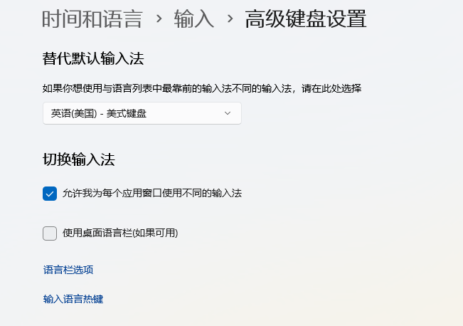
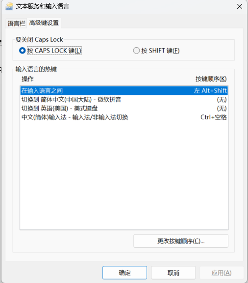
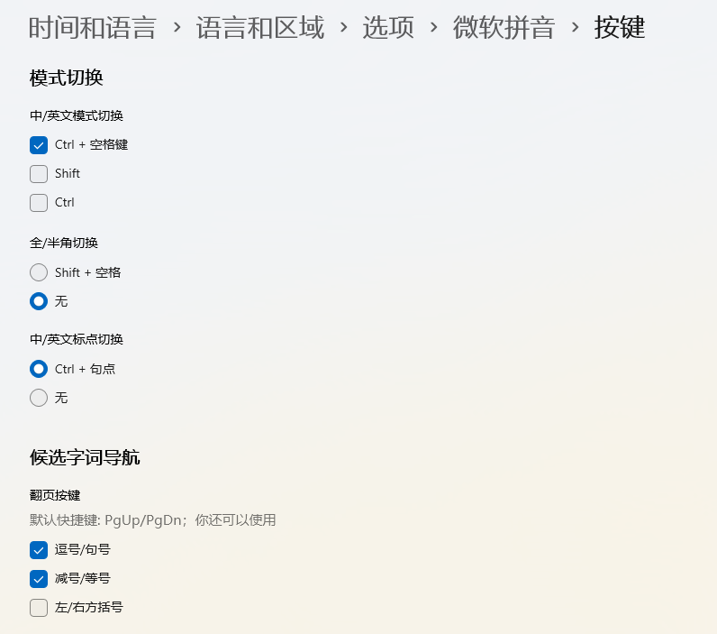
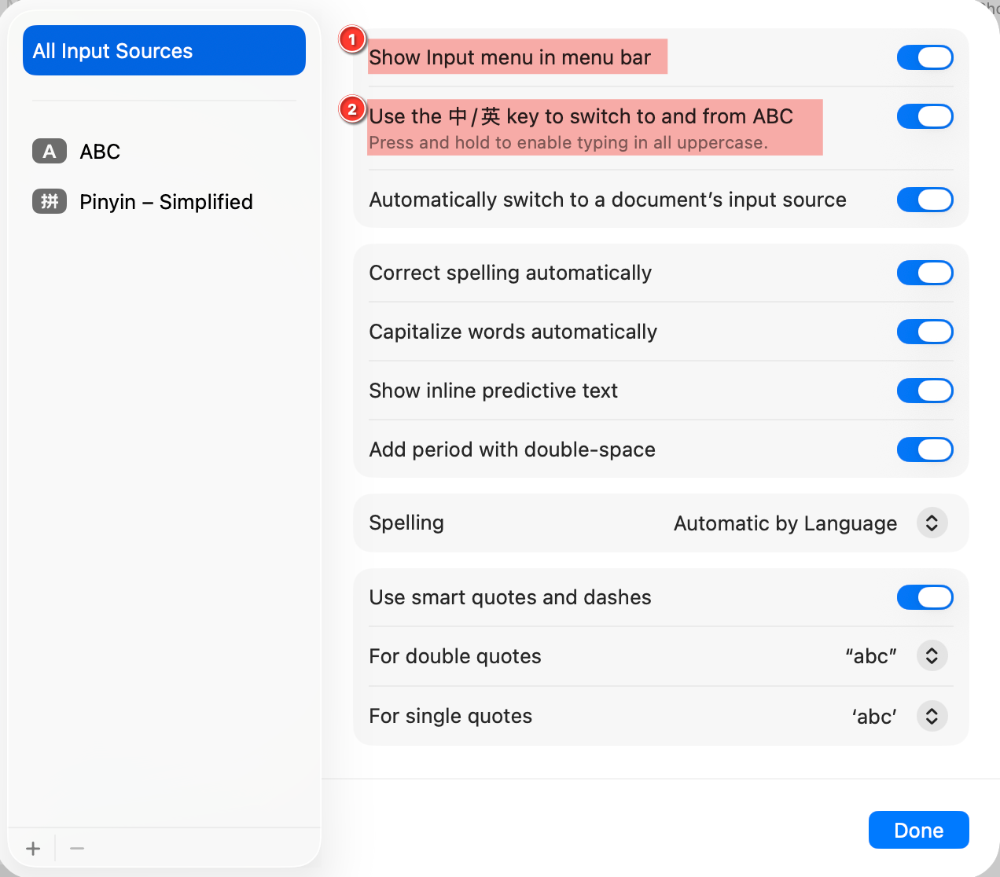
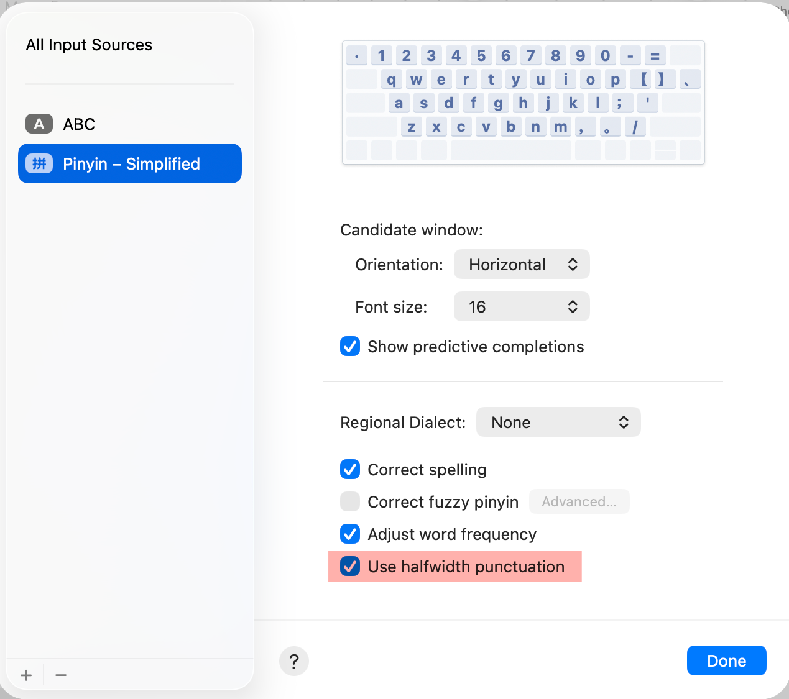

# Cross-Platform Caps Lock IME

[English](README.md) | [简体中文](README.zh-CN.md)

A small AutoHotkey v2 configuration that makes Chinese/English input switching
feel consistent between Windows and macOS.

On Windows, a short press of <kbd>Caps Lock</kbd> switches between the English
US keyboard and Microsoft Pinyin. On macOS, the built-in Caps Lock input-source
option provides the matching behavior.

The Windows script also replaces the mouse side buttons' browser Back/Forward
actions with fast vertical scrolling. This reduces the risk of accidentally
leaving a form and losing unsaved input.

## Behavior

| Input | Result |
| --- | --- |
| Release <kbd>Caps Lock</kbd> | Send <kbd>Left Alt</kbd> + <kbd>Left Shift</kbd> |
| Press mouse side button 1 | Scroll down 6 wheel steps |
| Press mouse side button 2 | Scroll up 6 wheel steps |
| Press <kbd>Ctrl</kbd> + <kbd>.</kbd> in Microsoft Pinyin | Persistently switch Chinese/English punctuation |
| Press <kbd>Caps Lock</kbd> normally | Native Caps Lock is suppressed |

The mappings are global: they apply to all applications.

## Why this setup exists

### One gesture on Windows and macOS

macOS can use Caps Lock to switch between a Latin input source such as ABC and
a non-Latin input source such as Simplified Pinyin. This project gives Windows
the same muscle memory.

### Safer mouse side buttons

Many mice map their side buttons to browser Back and Forward. An accidental
Back action can discard text on a form, an administration page, a checkout
flow, or any site that does not preserve unsaved state correctly.

The script consumes the original `XButton1` and `XButton2` events, preventing
their default navigation behavior, and gives the buttons a useful replacement:
fast scrolling.

## Important Windows input concepts

Windows has two different layers that may both look like "switching between
Chinese and English."

### Layer 1: keyboard layout or input method

For this project, the two input profiles are:

- English (United States) — US keyboard
- Chinese (Simplified, China) — Microsoft Pinyin

Windows can keep the active input profile local to each application window.
This is the layer switched by <kbd>Win</kbd> + <kbd>Space</kbd>,
<kbd>Left Alt</kbd> + <kbd>Shift</kbd>, and this script's Caps Lock mapping.

The complete input flow is:

```text
Caps Lock
    ↓ AutoHotkey sends Left Alt + Left Shift
Real input-profile switch: English US ↔ Microsoft Pinyin
                                           ↓ Ctrl + Space
                              Pinyin Chinese ↔ internal English mode
```

### Layer 2: Microsoft Pinyin's internal mode

Microsoft Pinyin itself has two modes:

- Chinese conversion mode
- Direct English input mode

The default Microsoft Pinyin shortcut is <kbd>Shift</kbd>. A legacy Windows
IME/Non-IME shortcut may also use <kbd>Ctrl</kbd> + <kbd>Space</kbd>.

This setup deliberately uses <kbd>Ctrl</kbd> + <kbd>Space</kbd> and disables
the standalone <kbd>Shift</kbd> mode switch. Caps Lock is already repurposed,
so Shift must remain dependable for typing uppercase English letters. Leaving
standalone Shift enabled makes accidental Pinyin mode changes more likely
while typing capitals.

This internal IME mode is not the same as selecting the English US keyboard.
Its state is not reliably restored per application. Applications and text
controls can also reset it.

For a terminal that should remain English and a notes application that should
remain Chinese, use the real English US keyboard in the terminal and Microsoft
Pinyin in the notes application. Do not rely on Microsoft Pinyin's temporary
English mode for that workflow.

## Requirements

- Windows 10 or Windows 11
- [AutoHotkey v2](https://www.autohotkey.com/download/)
- Exactly two input profiles are recommended:
  - English (United States) — US
  - Chinese (Simplified, China) — Microsoft Pinyin

The script declares `#Requires AutoHotkey v2.0`; it is not compatible with
AutoHotkey v1 syntax.

## Install AutoHotkey v2

1. Open the official [AutoHotkey download page](https://www.autohotkey.com/download/).
2. Download the current AutoHotkey v2 installer.
3. Run the installer.
4. Choose the current-user installation if administrator access is unavailable,
   or use the recommended default installation.
5. Confirm that `.ahk` files open with AutoHotkey v2.

The official documentation is available at
[AutoHotkey v2 Documentation](https://www.autohotkey.com/docs/v2/).

## Configure Windows input profiles

### Add English US and Microsoft Pinyin

1. Open **Settings**.
2. Go to **Time & language** > **Language & region**.
3. Ensure **English (United States)** has the **US** keyboard.
4. Ensure **Chinese (Simplified, China)** has **Microsoft Pinyin**.
5. Remove unused keyboard layouts if possible.

The script sends <kbd>Left Alt</kbd> + <kbd>Shift</kbd>, which cycles through
installed input profiles. With more than two profiles, Caps Lock may cycle to
an unexpected layout instead of behaving as a simple two-state toggle.

### Enable per-window input profiles

1. Open **Settings**.
2. Go to **Time & language** > **Typing**.
3. Open **Advanced keyboard settings**.
4. Enable **Let me use a different input method for each app window**.



**Figure 1:** Enable a different input method for each application window. In
this example, the default input-method override is English (United States) —
US keyboard, so new applications or controls without a saved local state begin
with the English keyboard.

This gives each active application window its own input-profile state. It is
not a permanent application-to-language rule: a new window, a restarted
application, or an application-created input control can inherit or reset the
state.

Recommended use:

- In Windows Terminal, switch to the real **ENG / US keyboard**.
- In a notes application, switch to **Microsoft Pinyin / Chinese mode**.
- Switch between the applications and verify that each window keeps its input
  profile.

### Confirm the input-language hotkey

1. Open **Settings** > **Time & language** > **Typing**.
2. Open **Advanced keyboard settings**.
3. Select **Input language hot keys**.
4. In **Advanced Key Settings**, confirm that switching input languages uses
   <kbd>Left Alt</kbd> + <kbd>Shift</kbd>.



**Figure 2:** "Between input languages" is assigned to
<kbd>Left Alt</kbd> + <kbd>Shift</kbd>. This is the Windows action sent by
AutoHotkey when Caps Lock is released. The separate Chinese IME/Non-IME entry
controls the second layer and is assigned to
<kbd>Ctrl</kbd> + <kbd>Space</kbd>.

<kbd>Win</kbd> + <kbd>Space</kbd> remains a useful way to inspect or manually
select the active input profile.

### Configure Microsoft Pinyin's internal shortcuts

Open:

1. **Settings** > **Time & language** > **Language & region**.
2. Open **Language options** for Chinese (Simplified, China).
3. Open **Keyboard options** for Microsoft Pinyin.
4. Select **Keys**.

Use the following configuration:



**Figure 3:**

- Enable only <kbd>Ctrl</kbd> + <kbd>Space</kbd> for Chinese/English mode.
- Disable standalone <kbd>Shift</kbd> and standalone <kbd>Ctrl</kbd> mode
  switching.
- Set full-width/half-width switching to **None**. This prevents an accidental
  <kbd>Shift</kbd> + <kbd>Space</kbd> while pressing
  <kbd>Ctrl</kbd> + <kbd>Space</kbd> from entering the rarely used full-width
  mode.
- Keep <kbd>Ctrl</kbd> + <kbd>.</kbd> enabled for Chinese/English punctuation.
- To make <kbd>Ctrl</kbd> + <kbd>.</kbd> toggle dynamically, turn off
  **Use English punctuation when typing Chinese** on Microsoft Pinyin's
  **General** page.

## Install the script

### Quick test

1. Download or clone this repository.
2. Double-click `capslock-ime-safe-mouse.ahk`.
3. Look for the AutoHotkey tray icon.
4. Test Caps Lock and both mouse side buttons.

To stop the test, right-click the AutoHotkey tray icon and select **Exit**.

### Start automatically with Windows

The simplest method:

1. Press <kbd>Win</kbd> + <kbd>R</kbd>.
2. Enter `shell:startup`.
3. Press <kbd>Enter</kbd>.
4. Create a shortcut in that folder pointing to
   `capslock-ime-safe-mouse.ahk`.
5. Sign out and back in, or run the shortcut once.

### Optional configuration-directory layout

To keep the editable configuration outside the Startup folder:

1. Create:

   ```text
   C:\Users\YOUR_USERNAME\.config\autohotkey\
   ```

2. Copy `capslock-ime-safe-mouse.ahk` into that directory.
3. Open `startup-loader.example.ahk`.
4. Replace `YOUR_USERNAME` with the actual Windows user name.
5. Rename it to `autohotkey-startup-loader.ahk`.
6. Copy the loader into the folder opened by `shell:startup`.

The loader contains only a version requirement and an `#Include` directive.
AutoHotkey starts the loader at sign-in and loads the main configuration from
the stable `.config` location.

## Core script

See [`capslock-ime-safe-mouse.ahk`](capslock-ime-safe-mouse.ahk) for the
complete, directly runnable script.

```ahk
#Requires AutoHotkey v2.0
#SingleInstance Force

InstallKeybdHook
SetCapsLockState "AlwaysOff"

*SC03A::Return
*SC03A Up::
{
    SendEvent "{LAlt down}{LShift down}"
    Sleep 30
    SendEvent "{LShift up}{LAlt up}"
}

XButton1::Send "{WheelDown 6}"
XButton2::Send "{WheelUp 6}"

#HotIf IsSimplifiedChineseLayoutActive()
^.::TogglePersistentPunctuation()
#HotIf
```

## Code explanation

### `#Requires AutoHotkey v2.0`

Tells the AutoHotkey launcher that the script requires v2. It also prevents the
file from being interpreted accidentally as a v1 script.

### `#SingleInstance Force`

If the script is launched again, the existing instance is replaced instead of
showing a duplicate-instance prompt. This is useful while editing and
reloading the configuration.

### `InstallKeybdHook`

Installs the keyboard hook so that the physical Caps Lock key can be captured
reliably.

### `SetCapsLockState "AlwaysOff"`

Keeps the native Caps Lock state off. The key is repurposed for input switching
instead of locking all letter keys to uppercase.

### `SC03A`

`SC03A` is the physical scan code commonly used by the Caps Lock key.

```ahk
*SC03A::Return
```

Suppresses the key-down event. The wildcard `*` means the hotkey also matches
when Ctrl, Alt, Shift, or Win is held.

```ahk
*SC03A Up::
```

Runs the action only when Caps Lock is released. This creates a clean
single-press gesture.

### Sending Left Alt + Left Shift

```ahk
SendEvent "{LAlt down}{LShift down}"
Sleep 30
SendEvent "{LShift up}{LAlt up}"
```

The script presses both modifier keys, holds them for 30 milliseconds so
Windows can recognize the combination reliably, then releases them.

### Mouse side-button remapping

```ahk
XButton1::Send "{WheelDown 6}"
XButton2::Send "{WheelUp 6}"
```

The original side-button events are consumed, so browsers no longer receive
Back or Forward. Each press sends six wheel steps instead.

Mouse hardware can label or order the two side buttons differently. If the
scroll direction feels reversed, swap `WheelDown` and `WheelUp`. To change the
scroll speed, replace `6` with another positive number.

### Persistent punctuation switching

Microsoft Pinyin's native punctuation state is not reliably retained across
applications. The script therefore intercepts <kbd>Ctrl</kbd> +
<kbd>.</kbd> while the Simplified Chinese layout is active:

```ahk
currentValue := RegRead(settingsKey, valueName, 0)
newValue := currentValue ? 0 : 1
RegWrite newValue, "REG_DWORD", settingsKey, valueName
```

It directly toggles:

```text
HKCU\Software\Microsoft\InputMethod\Settings\CHS
UseEnglishPunctuationsInChineseInputMode
```

- `0`: Chinese punctuation.
- `1`: force English punctuation while typing Chinese.

After writing the value, the script requests English US and then Simplified
Chinese for the active window. This forces Microsoft Pinyin to reload the
setting immediately. A short tooltip reports either "Punctuation: English" or
"Punctuation: Chinese."

The `#HotIf` condition intercepts the shortcut only while the Simplified
Chinese layout is active. With the English US keyboard active,
<kbd>Ctrl</kbd> + <kbd>.</kbd> remains available to the current application.

## Microsoft Pinyin punctuation and width

These shortcuts apply while Microsoft Pinyin is active:

| Shortcut | Action |
| --- | --- |
| <kbd>Ctrl</kbd> + <kbd>Space</kbd> | Switch Microsoft Pinyin between Chinese and internal English mode |
| <kbd>Ctrl</kbd> + <kbd>.</kbd> | Persistently switch Chinese/English punctuation through AutoHotkey |
| <kbd>Shift</kbd> | Disabled as a mode switch so it remains available for uppercase letters |
| <kbd>Shift</kbd> + <kbd>Space</kbd> | Disabled to prevent accidental full-width mode |

For Chinese text with ASCII punctuation, use:

- Microsoft Pinyin in Chinese conversion mode
- English punctuation
- Half-width characters

Example:

```text
中文输入, but ASCII punctuation: ()[]{}:;,.!?
```

Microsoft's current reference:
[Microsoft Simplified Chinese IME](https://support.microsoft.com/zh-CN/Windows/Hardware/Input-Devices/microsoft-simplified-chinese-ime).

### Why `Ctrl + .` can appear to do nothing

The limitation below describes **Microsoft Pinyin's native behavior**. The
current project script bypasses it by intercepting the shortcut, toggling the
persistent registry preference, and refreshing the active input layout.

First check this option on Microsoft Pinyin's **General** page:

```text
Use English punctuation when typing Chinese
```

When this fixed option is enabled, the modern Microsoft Pinyin IME forces
English punctuation and ignores <kbd>Ctrl</kbd> + <kbd>.</kbd>. The shortcut
can still appear as enabled on the **Keys** page, but it will not toggle the
punctuation mode. This is a known behavior of the modern IME.

To enable dynamic switching:

1. Open **Settings** > **Time & language** > **Language & region**.
2. Open **Language options** for Chinese (Simplified, China).
3. Open **Keyboard options** for Microsoft Pinyin.
4. Select **General**.
5. Turn off **Use English punctuation when typing Chinese**.
6. Return to **Keys** and keep
   <kbd>Ctrl</kbd> + <kbd>.</kbd> enabled.
7. Switch away from Microsoft Pinyin and back, or close and reopen the current
   text field.

With the fixed option disabled, the shortcut shows no notification. It only
changes punctuation typed **afterward**, and Microsoft documents it as working
only while Pinyin is in **Chinese mode**.

Test it in Windows Notepad:

1. Select Microsoft Pinyin and confirm that it is in Chinese mode.
2. Type comma and period. Chinese punctuation mode should produce:

   ```text
   ，。
   ```

3. Press <kbd>Ctrl</kbd> + <kbd>.</kbd> once.
4. Type comma and period again. English punctuation mode should produce:

   ```text
   ,.
   ```

If both tests produce `,.`, check these in order:

1. Confirm that **Use English punctuation when typing Chinese** is off.
2. Confirm that Pinyin is not in its internal English mode. Press
   <kbd>Ctrl</kbd> + <kbd>Space</kbd> to return to Chinese mode and test again.

If it works in Notepad but not in a particular application, that application
is intercepting the shortcut. If it also fails in Notepad:

1. Confirm that <kbd>Ctrl</kbd> + <kbd>.</kbd> is still selected on Microsoft
   Pinyin's **Keys** page.
2. Set the option to **None**, save, then enable it again.
3. Switch away from Microsoft Pinyin and back; if necessary, sign out and sign
   back in to Windows.

Character width and punctuation mode are separate settings. Disabling the
full-width/half-width shortcut does not disable
<kbd>Ctrl</kbd> + <kbd>.</kbd>.

In practice, the modern Pinyin IME requires a choice:

- **Always use English punctuation:** enable the fixed option, but dynamic
  <kbd>Ctrl</kbd> + <kbd>.</kbd> switching is unavailable.
- **Allow dynamic switching:** disable the fixed option, then use
  <kbd>Ctrl</kbd> + <kbd>.</kbd>.

Microsoft community report:
[Ctrl+period stops working when fixed English punctuation is enabled](https://learn.microsoft.com/zh-cn/answers/questions/3842555/windows11-ctrl).

This project's AutoHotkey workaround treats the fixed preference itself as a
two-state switch. The selected punctuation mode is stored in the user's
registry and is therefore reused by applications and text fields opened later.

## Matching macOS configuration

No AutoHotkey script is required on macOS.

### Use Caps Lock to switch input sources

1. Open **System Settings** > **Keyboard**.
2. Under **Text Input**, click **Edit**.
3. Add both **ABC** and **Pinyin - Simplified**, if they are not already present.
4. Enable **Use the Caps Lock key to switch to and from ABC**.



**Figure 4:** Keep ABC and Pinyin - Simplified under All Input Sources, show
the Input menu, and enable the dedicated Chinese/English key for switching to
and from ABC. Depending on the keyboard and macOS version, this option may be
labelled Caps Lock instead. The same figure also shows
**Automatically switch to a document's input source** enabled.

A short press of Caps Lock switches between ABC and Simplified Pinyin. On
supported Apple keyboards and macOS versions, holding Caps Lock activates
normal uppercase lock.

Apple reference:
[Switch to a Chinese or Cantonese input source](https://support.apple.com/guide/chinese-input-method/cim119a8d473/mac).

### Remember input sources by document

1. Open **System Settings** > **Keyboard**.
2. Under **Text Input**, click **Edit**.
3. Select **All Input Sources**.
4. Enable **Automatically switch to a document's input source**.

This switch appears directly below the input-source switching option in
Figure 4.

macOS associates the selected input source with a document until it is closed.
This is document-oriented, not a permanent rule assigning one input source to
an entire application. Support can vary for terminal tabs, panes, browser text
fields, and applications that do not expose normal document contexts.

Apple reference:
[Change Input Sources settings on Mac](https://support.apple.com/guide/mac-help/mchl84525d76/mac).

### Use half-width punctuation in Simplified Pinyin

1. Switch to **Pinyin - Simplified**.
2. Open the input menu in the macOS menu bar.
3. Select **Open Pinyin - Simplified Settings**.
4. Enable **Use half-width punctuation**.



**Figure 5:** Select Pinyin - Simplified in the sidebar and enable
**Use halfwidth punctuation**. Commas, periods, brackets, and similar
punctuation typed in Chinese input mode will use half-width forms where
possible, which is useful for code, Markdown, commands, and file names.

The corresponding shortcut is <kbd>Option</kbd> + <kbd>Shift</kbd> +
<kbd>H</kbd>.

Apple reference:
[Change Chinese and Cantonese input source settings](https://support.apple.com/guide/chinese-input-method/cim21aa5fa50/mac).

## Reload, pause, or exit

After editing the script:

1. Right-click its AutoHotkey tray icon.
2. Select **Reload Script**.

Use **Pause Script** or **Suspend Hotkeys** for temporary troubleshooting. Use
**Exit** to stop it completely.

## Troubleshooting

### Caps Lock does not switch the expected two profiles

Remove unused keyboard layouts or use <kbd>Win</kbd> + <kbd>Space</kbd> to
inspect the active list. <kbd>Alt</kbd> + <kbd>Shift</kbd> cycles profiles; it
does not select two profiles by identity.

### A shortcut works in normal applications but not an elevated application

Windows integrity boundaries can prevent a normal process from sending input
to an administrator-level application. Run both at the same privilege level.
Avoid running the script as administrator unless that access is actually
needed.

### Caps Lock still changes letter case

Confirm that only one copy of the script is running and that another keyboard
utility is not remapping Caps Lock. Reload the script after changes.

### Mouse scrolling is reversed

Swap the two final mappings:

```ahk
XButton1::Send "{WheelUp 6}"
XButton2::Send "{WheelDown 6}"
```

### A browser still navigates Back or Forward

Check for mouse-vendor software that performs navigation before AutoHotkey
receives the button event. Disable the Back/Forward assignment in that software
or map the hardware buttons to generic `XButton1` and `XButton2`.

## Uninstall

1. Exit the running script from its tray icon.
2. Remove its shortcut or loader from `shell:startup`.
3. Delete the copied script from `.config\autohotkey` if that layout was used.
4. AutoHotkey itself can remain installed for other scripts, or be removed from
   **Settings** > **Apps** > **Installed apps**.

## Author

guohongbo — [guohongbo@outlook.com](mailto:guohongbo@outlook.com)

## License

[MIT](LICENSE)
